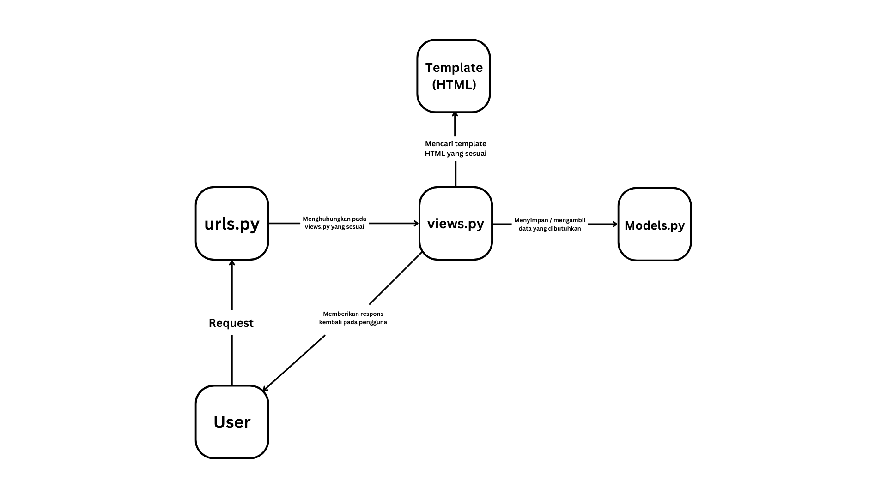

# Gedebook - Aplikasi Inventory Buku

## Tugas 2
**1. Jelaskan bagaimana cara kamu mengimplementasikan checklist di atas secara step-by-step (bukan hanya sekadar mengikuti tutorial)**
* Saya membuat proyek Django baru dengan menggunakan command `django-admin startproject Gedebook .` pada folder yang saya mau dan posisi _virtual environment_ menyala.
* Lalu saya membuat aplikasi `main` pada proyek Django dengan menjalankan command `python manage.py startapp main`, serta mendaftarkan aplikasi `main` pada proyek Django dengan menambahkan string _'main'_ pada variabel `INSTALLED_APPS` di `settings.py`.
* Konfigurasi URL harus dilakukan pada 2 tempat berbeda, yaitu `urls.py` pada direktori proyek Django dan `urls.py` pada direktori aplikasi. Hal ini harus dilakukan karena proyek Django bisa memiliki beberapa aplikasi dan aplikasi bisa memiliki beberapa halaman.
  Pada berkas `urls.py` yang terdapat di direktori aplikasi `main` ditambahkan 2 import fungsi yaitu `from django.urls import path` dan `from main.views import show_main`. Kemudian saya menambahkan variabel `app_name` yang menyatakan nama dari aplikasi serta membuat list `urlpatterns` yang menyimpan elemen `path('', show_main, name='show_main')`.
  Pada berkas `urls.py` yang terdapat di direktori proyek Django ditambahkan 1 import fungsi yaitu `from django.urls import path, include`, lalu ditambahkan 1 elemen pada list `urlpatterns` dengan nilai `path('main/', include('main.urls'))`.
  Kedua hal ini dilakukan agar halaman-halaman yang terdapat di aplikasi `main` bisa terhubung dan pola URL bisa dimengerti, serta aplikasi-aplikasi yang terdapat dalam sebuah proyek Django juga terhubung.
* Selain itu, berkas `models.py` yang berada di dalam direktori aplikasi `main` juga saya ubah agar sesuai dengan ketentuan. Variabel-variabel yang terdapat di `models.py` akan menentukan struktur dari database yang akan dipakai pada website ini.
  Setelah itu, saya melakukan `python manage.py makemigrations` dan `python manage.py migrate` agar perubahan yang saya lakukan pada `models.py` bisa diimplementasikan.
* Pada file `views.py` yang terdapat di direktori aplikasi, ditambahkan sebuah import `from django.shortcuts import render` serta menambahkan fungsi `show_main` agar halaman website bisa dirender sesuai dengan data yang dibutuhkan nantinya dan bukan hanya menjadi halaman statis.
  Namun, untuk sekarang saya mengisi variabel `context` secara statis.
* Deployment pada Adaptable dilakukan dengan menyesuaikan pemakaian framework, versi bahasa, serta _start command_ sehingga Adaptable bisa menjalankan proyek yang telah dibuat dengan baik.

**2. Buatlah bagan yang berisi request client ke web aplikasi berbasis Django beserta responnya dan jelaskan pada bagan tersebut kaitan antara urls.py, views.py, models.py, dan berkas html**

**3. Jelaskan mengapa kita menggunakan virtual environment? Apakah kita tetap dapat membuat aplikasi web berbasis Django tanpa menggunakan virtual environment?**
* Dalam membuat aplikasi web berbasis Django yang akan melibatkan banyak pengguna, pembuat, dan web hosting, _virtual environment_ berperan penting dalam kesesuaian versi dari program-program yang dipakai untuk menjalankan aplikasi. User dan developer pastinya memakai peerangkat yang memiliki versi program yang bervariasi. Hal ini bisa terjadi karena beberapa hal seperti kompatibilitas perangkat, kebutuhan spesifik pengguna, dll. _Virtual Environment_ membuat sebuah perangkat memiliki program dengan versi-versi tertentu yang sesuai dengan kebutuhan agar website bisa dibuat & dijalankan dengan baik.
*  Jika _virtual environment_ tidak digunakan, aplikasi web bisa saja tetap berjalan. Namun, web tersebut akan sering memiliki masalah seiring berjalannya waktu dan akan sangat sulit untuk developer mengembangkan website tersebut.

**4. Jelaskan apakah itu MVC, MVT, MVVM dan perbedaan dari ketiganya.**
* MVC adalah singkatan dari `Model-View-Controller` yang merupakan sebuah arsitektur/_framework_ dalam pengembangan web. Pada _framework_ ini, `Model` berperan dalam menyimpan dan mengolah data, `View` berperan dalam menampilkan halaman dan menerima respon pengguna, dan `Controller` menghubungkan `Model` dan `View` sehingga keduanya bisa berinteraksi dengan baik dan aman.
* MVT adalah singkatan dari `Model-View-Template` yang juga merupakan sebuah _framework_ pengembangan web. Pada _framework_ ini, `Model` berperan untuk menyimpan dan mengolah data selayaknya pada MVC, `View` berperan dalam menampilkan halaman, dan `Template` berperan untuk mengatur tampilan yang dibutuhkan yang didapatkan dari `Model`.
* MVVM adalah singkatan dari `Model-View-ViewModel` yang juga merupakan _framework_ pengembangan web. Sama seperti _framework_ sebelumnya, `Model` berperan untuk menyimpan dan mengolah data dan `View` berperan dalam menampilkan halaman. Namun, pada _framework_ ini, penghubung antara keduanya disebut sebagai `ViewModel`.
* Ketiga _framework_ tersebut memiliki konsep utama yang sama yaitu terdapat bagian penyimpan dan pengelola, penampilan, dan perantara. Namun, perbedaan utama terdapat pada implementasi serta pembagian tugasnya. Beberapa _framework_ mungkin lebih menitik-beratkan tugas pada `Model` daripada penengah maupun sebaliknya. Sehingga struktur dan cara kerja tiap _framework_ berbeda dan membuat perbedaan dalam cara mengembangkan, logika, dan keamanan. Walaupun begitu, ketiga _framework_ tersebut mampu menampilkan halaman-halaman yang sama.

**Bonus**
* Pada file `test.py`, saya telah menambahkan uji coba untuk file penyimpanan data yaitu `models.py`. Pada test ini, saya mencoba membuat sebuah object `Product` dan memastikan bahwa object yang telah dibuat sama dengan yang seharusnya.
 
 
