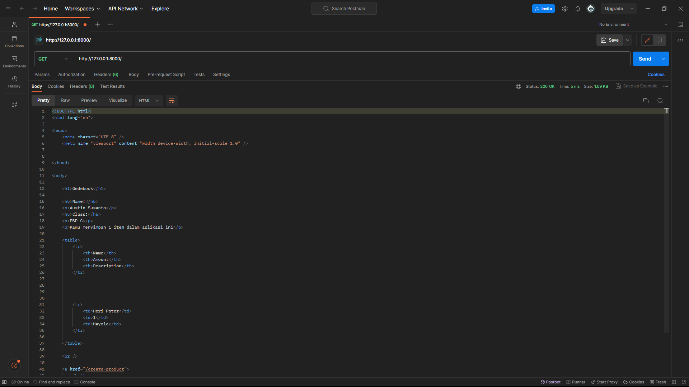
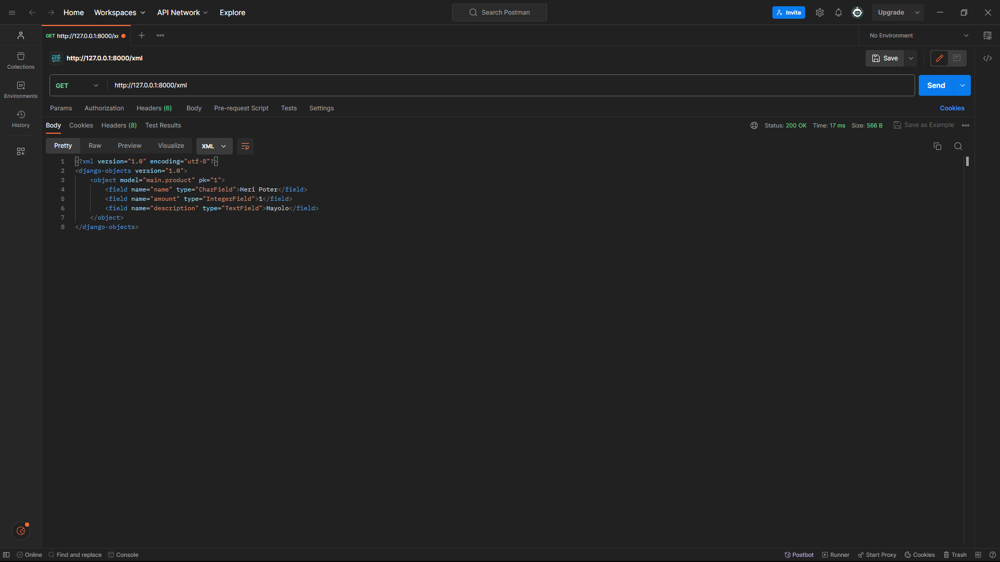
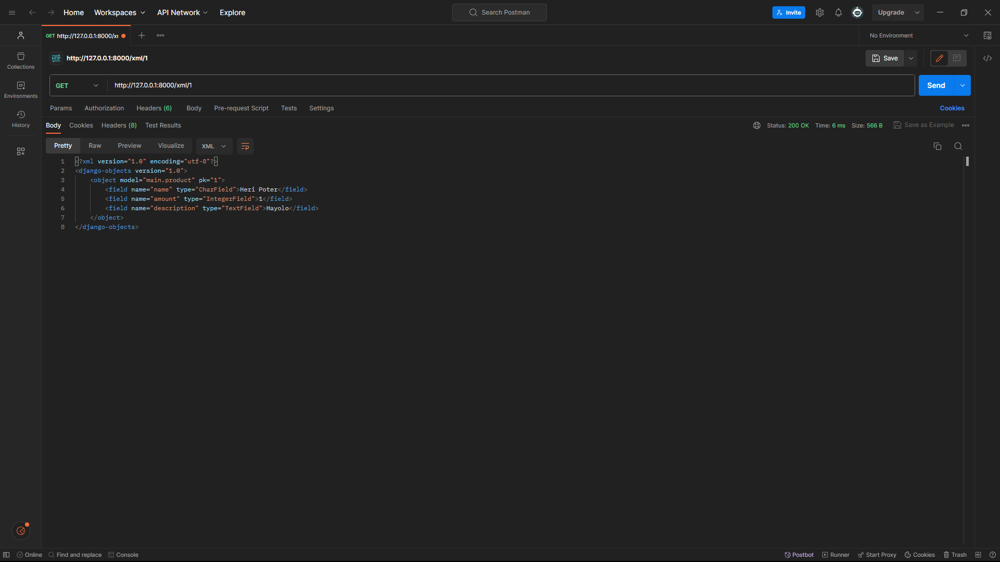
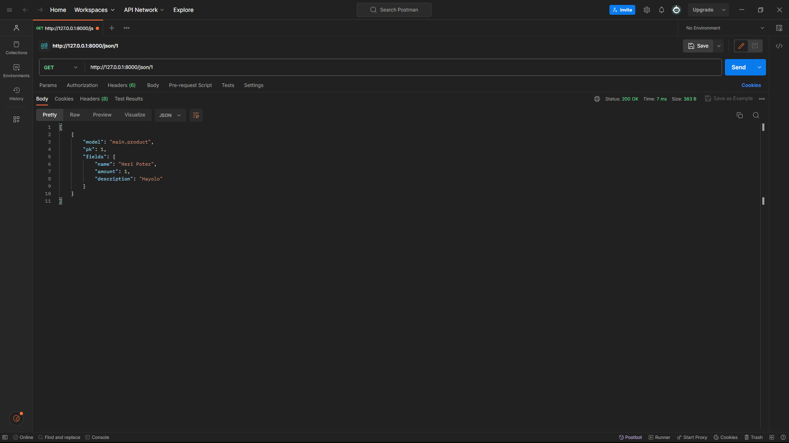

# Gedebook - Aplikasi Inventory Buku

## Tugas 2
**1. Jelaskan bagaimana cara kamu mengimplementasikan checklist di atas secara step-by-step (bukan hanya sekadar mengikuti tutorial)**
* Saya membuat proyek Django baru dengan menggunakan command `django-admin startproject Gedebook .` pada folder yang saya mau dan posisi _virtual environment_ menyala.
* Lalu saya membuat aplikasi `main` pada proyek Django dengan menjalankan command `python manage.py startapp main`, serta mendaftarkan aplikasi `main` pada proyek Django dengan menambahkan string _'main'_ pada variabel `INSTALLED_APPS` di `settings.py`.
* Konfigurasi URL harus dilakukan pada 2 tempat berbeda, yaitu `urls.py` pada direktori proyek Django dan `urls.py` pada direktori aplikasi. Hal ini harus dilakukan karena proyek Django bisa memiliki beberapa aplikasi dan aplikasi bisa memiliki beberapa halaman.
  Pada berkas `urls.py` yang terdapat di direktori aplikasi `main` ditambahkan 2 import fungsi yaitu `from django.urls import path` dan `from main.views import show_main`. Kemudian saya menambahkan variabel `app_name` yang menyatakan nama dari aplikasi serta membuat list `urlpatterns` yang menyimpan elemen `path('', show_main, name='show_main')`.
  Pada berkas `urls.py` yang terdapat di direktori proyek Django ditambahkan 1 import fungsi yaitu `from django.urls import path, include`, lalu ditambahkan 1 elemen pada list `urlpatterns` dengan nilai `path('main/', include('main.urls'))`.
  Kedua hal ini dilakukan agar halaman-halaman yang terdapat di aplikasi `main` bisa terhubung dan pola URL bisa dimengerti, serta aplikasi-aplikasi yang terdapat dalam sebuah proyek Django juga terhubung.
* Selain itu, berkas `models.py` yang berada di dalam direktori aplikasi `main` juga saya ubah agar sesuai dengan ketentuan. Variabel-variabel yang terdapat di `models.py` akan menentukan struktur dari database yang akan dipakai pada website ini.
  Setelah itu, saya melakukan `python manage.py makemigrations` dan `python manage.py migrate` agar perubahan yang saya lakukan pada `models.py` bisa diimplementasikan.
* Pada file `views.py` yang terdapat di direktori aplikasi, ditambahkan sebuah import `from django.shortcuts import render` serta menambahkan fungsi `show_main` agar halaman website bisa dirender sesuai dengan data yang dibutuhkan nantinya dan bukan hanya menjadi halaman statis.
  Namun, untuk sekarang saya mengisi variabel `context` secara statis.
* Deployment pada Adaptable dilakukan dengan menyesuaikan pemakaian framework, versi bahasa, serta _start command_ sehingga Adaptable bisa menjalankan proyek yang telah dibuat dengan baik.

**2. Buatlah bagan yang berisi request client ke web aplikasi berbasis Django beserta responnya dan jelaskan pada bagan tersebut kaitan antara urls.py, views.py, models.py, dan berkas html**

**3. Jelaskan mengapa kita menggunakan virtual environment? Apakah kita tetap dapat membuat aplikasi web berbasis Django tanpa menggunakan virtual environment?**
* Dalam membuat aplikasi web berbasis Django yang akan melibatkan banyak pengguna, pembuat, dan web hosting, _virtual environment_ berperan penting dalam kesesuaian versi dari program-program yang dipakai untuk menjalankan aplikasi. User dan developer pastinya memakai peerangkat yang memiliki versi program yang bervariasi. Hal ini bisa terjadi karena beberapa hal seperti kompatibilitas perangkat, kebutuhan spesifik pengguna, dll. _Virtual Environment_ membuat sebuah perangkat memiliki program dengan versi-versi tertentu yang sesuai dengan kebutuhan agar website bisa dibuat & dijalankan dengan baik.
*  Jika _virtual environment_ tidak digunakan, aplikasi web bisa saja tetap berjalan. Namun, web tersebut akan sering memiliki masalah seiring berjalannya waktu dan akan sangat sulit untuk developer mengembangkan website tersebut.

**4. Jelaskan apakah itu MVC, MVT, MVVM dan perbedaan dari ketiganya.**
* MVC adalah singkatan dari `Model-View-Controller` yang merupakan sebuah arsitektur/_framework_ dalam pengembangan web. Pada _framework_ ini, `Model` berperan dalam menyimpan dan mengolah data, `View` berperan dalam menampilkan halaman dan menerima respon pengguna, dan `Controller` menghubungkan `Model` dan `View` sehingga keduanya bisa berinteraksi dengan baik dan aman.
* MVT adalah singkatan dari `Model-View-Template` yang juga merupakan sebuah _framework_ pengembangan web. Pada _framework_ ini, `Model` berperan untuk menyimpan dan mengolah data selayaknya pada MVC, `View` berperan dalam menampilkan halaman, dan `Template` berperan untuk mengatur tampilan yang dibutuhkan yang didapatkan dari `Model`.
* MVVM adalah singkatan dari `Model-View-ViewModel` yang juga merupakan _framework_ pengembangan web. Sama seperti _framework_ sebelumnya, `Model` berperan untuk menyimpan dan mengolah data dan `View` berperan dalam menampilkan halaman. Namun, pada _framework_ ini, penghubung antara keduanya disebut sebagai `ViewModel`.
* Ketiga _framework_ tersebut memiliki konsep utama yang sama yaitu terdapat bagian penyimpan dan pengelola, penampilan, dan perantara. Namun, perbedaan utama terdapat pada implementasi serta pembagian tugasnya. Beberapa _framework_ mungkin lebih menitik-beratkan tugas pada `Model` daripada penengah maupun sebaliknya. Sehingga struktur dan cara kerja tiap _framework_ berbeda dan membuat perbedaan dalam cara mengembangkan, logika, dan keamanan. Walaupun begitu, ketiga _framework_ tersebut mampu menampilkan halaman-halaman yang sama.

**Bonus**
* Pada file `test.py`, saya telah menambahkan uji coba untuk file penyimpanan data yaitu `models.py`. Pada test ini, saya mencoba membuat sebuah object `Product` dan memastikan bahwa object yang telah dibuat sama dengan yang seharusnya.
 
 

## Tugas 3
**1. Apa perbedaan antara form `POST` dan form `GET` dalam Django?**
* Pada dasarnya, form `post` dan `get` memiliki tujuan utama yang berbeda. Form `post` digunakan agar user bisa mengirimkan data pada server web sedangkan form `get` digunakan agar user bisa meminta data tertentu untuk dikirimkan oleh server web.
* Form `post` biasa digunakan untuk melakukan login dan mengirimkan username, password, ataupun data pribadi user sehingga form `post` bersifat lebih tertutup dan rahasia, sedangkan form `get` lebih terbukan dan biasa dibagikan antar user dalam bentuk link sehingga user lain bisa meminta data yang sama pada server web tersebut.
* Selain itu, form `post` biasanya bersifat lebih terbatas dalam besar data yang dikirimkan. Hal ini dikarenakan web server harus menampung banyak data yang berbeda dari setiap user yang menginput. Selain itu, juga ada kemungkinan user yang sengaja menginput data yang besar agar web server penuh. Sedangkan form `get` tidak terlalu ketat dalam jumlah data yang dikirimkan. Hal ini dikarenakan jumlah data yang dikirimkan oleh form `get` dari server ke user selalu sama, sehingga pengiriman data bisa diukur.

**2. Apa perbedaan utama antara XML, JSON, dan HTML dalam konteks pengiriman data?**
* Secara umum, HTML memiliki perbedaan besar dari JSON dan XML pada segi tujuan. HTML dibuat untuk mengirimkan data yang menggambarkan struktur dari tampilan web sedangkan JSON dan XML digunakan untuk melakukan pertukaran data terstruktur. Walaupun sintaks HTML berbasis tag seperti XML, data yang tertulis pada kedua jenis file tersebut akan jauh berbeda. Data dari file HTML dibuat sebagai konten yang akan dibaca user web sedangkan data pada JSON dan XML dibuat untuk diproses oleh aplikasi lain.
* JSON dan XML adalah 2 jenis file yang digunakan untuk pertukaran data terstruktur. Perbedaan dari kedua tipe file ini adalah cara penulisannya. XML menggunakan model penulisan berbasis `tag` yang relatif mudah untuk dibaca oleh pengguna awam. Sedangkan JSON menggunakan model penulisan `value-key pair` seperti mapping yang relatif lebih mudah dibaca oleh pengguna yang memiliki pengetahuan di bidang komputer.

**3. Mengapa JSON sering digunakan dalam pertukaran data antara aplikasi web modern?**
* Secara umum, JSON memiliki beberapa keuntungan pemakaian dibandingkan tipe file lain dari segi performa, kemudahan pemakaian, dan kompatibilitas. Untuk performa, JSON merupakan tipe file yang ringan dan mudah dibaca, serta memiliki struktur data yang sederhana. JSON juga memiliki fitur pemarsialan parsial yang memperbolehkan program untuk membaca sebagian dari data dalam JSON tanpa membacanya secara keseluruhan. Dari segi kemudahan pemakaian, user akan banyak terbantu karena banyaknya penggunaan JSON sehingga akan lebih mudah mencari bantuan/bertanya kepada orang lain. Struktur data yang sederhana juga merupakan keuntungan bagi programmer sehingga mereka bisa membaca langsung file JSON tanpa menggunakan program untuk melakukan debugging. Keuntungan terbesar dari pemakaian JSON adalah dari segi kompatibilitasnya. Data dalam file JSON bisa diubah langsung ke dalam objek dalam javascript, serta banyak sekali aplikasi-aplikasi lain yang memungkinkan untuk memakai file JSON untuk pertukaran data.

**4. Jelaskan bagaimana cara kamu mengimplementasikan _checklist_ di atas secara _step-by-step_ (bukan hanya sekedar mengikuti tutorial)!**
* Untuk membuat form pada website, saya terlebih dahulu membuat file `forms.py` pada direktori `main` yang bisa digunakan untuk membuat objek `ProductForm`.
* Setelah itu, saya membuat fungsi bernama `create_product` yang mengoperasikan apa yang akan dilakukan oleh halaman form pada website. Fungsi tersebut akan menyimpan nilai yang diinput dari form dan memasukkan data baru tersebut ke dalam model jika method yang dipakai adalah `POST`. Selain itu, jika method yang dipakai adalah `GET`, website akan merender halaman form yang bernama `create_product.html`.
* Setelah itu, saya mengubah fungsi `show_main` pada berkas `views.py` dan mengoper setiap nilai objek pada `context` sehingga data bisa diakses oleh file `HTML` nantinya.
* Sebelum fungsi `create_product` bisa digunakan, saya harus terlebih dulu melakukan import dan memberikan path pada file `urls.py`.
* File `create_product.html` juga saya buat agar terdapat halaman yang menampilkan form untuk user menginput data yang baru.
* Isi dari file `main.html` juga saya ubah sehingga bisa mengakses nilai-nilai dalam database dengan menggunakan `{{products.nama_variabel}}`. Hal ini bisa dilakukan karena nilai-nilai dalam database sudah dikirimkan oleh file `views.py` melalui variabel `context`.

* Untuk membuat fungsi `views` yang mengembalikan objek dalam format `XML` dan `JSON`, saya membuat fungsi `show_xml` dan `show_json`. Pada kedua fungsi saya mengambil seluruh objek yang terdapat pada model saya dengan method `Product.objects.all()`. Lalu saya mengembalikan data tersebut dalam bentuk `HttpResponse`. Namun data harus terlebih dahulu di serialisasi menjadi bentuk `XML` ataupun `JSON` sehingga terbentuk kode `return HttpResponse(serializers.serialize("xml", data), content_type="application/xml")` dan `return HttpResponse(serializers.serialize("json", data), context="application/json")`.
* Untuk membuat fungsi `views` yang mengembalikan objek dalam format `XML by ID` dan `JSON by ID`, saya hanya melakukan hal yang sama dengan langkah sebelumnya dengan membuat fungsi dengan nama `show_xml_by_id` dan `show_json_by_id`. Perbedaan tahap ini dengan tahap sebelumnya adalah fungsi ini memiliki 2 parameter, yaitu `request` dan `id`. Parameter `id` akan dipakai untuk memilih data tertentu berdasarkan index dengan cara mengubah kode `Product.objects.all()` menjadi `Products.objects.filter(pk=id)`.
* Untuk membuat fungsi `views` yang mengembalikan `HTML`, dibutuhkan fungsi `show_main` yang sedikit berbeda yaitu dengan melakukan `return render(request, "main.html", context)`. String `main.html` menandakan file `HTML` yang akan dirender dan variabel `context` adalah data yang bisa digunakan untuk menjadikan konten `HTML` menjadi dinamis.
 
* Untuk melakukan routing pada fungsi `show_xml` dan `show_json` yang telah dibuat, saya harus mengubah file `urls.py` yang terdapat di direktori main. Saya mengimport fungsi `show_xml` dan `show_json` dari berkas `main.views`, lalu memakainya dalam path seperti ini `path('xml', show_xml, name="show_xml")` dan `path('json' show_json, name='show_json')`.
* Untuk melakukan routing pada fungsi `show_xml_by_id` dan `show_json_by_id`, saya melakukan hal yang sama seperti diatas dengan mengimport kedua fungsi tersebut pada file `views.py`. Namun, pemberian path pada kedua fungsi ini dilakukan dengan berbeda karena harus memberikan input `id` yang akan digunakan untuk memilih data yang akan diambil, sehingga terbentuk kode `path('xml/<int:id>/', show_xml_by_id, name='show_xml_by_id')` dan `path('json/<int:id>', show_json_by_id, name='show_json_by_id')`.
* Untuk melakukan routing pada fungsi `show_main`, saya melakukan pathing di berkas `urls.py` dengan kode `path('', show_main, name='show_main')`. Pada routing ini tidak diberikan nama pada link sehinga halaman ini adalah halaman utama yang akan terbuka jika user mencari link website tanpa tambahan.

**5. Mengakses kelima URL di poin 2 menggunakan Postman, membuat _screenshot_ dari hasil akses URL pada Postman, dan menambahkannya ke dalam `README.md`.**
* HTML

* XML

* JSON

* XML by ID

* JSON by ID

**Bonus**
* Telah ditambahkan tulisan dalam file `HTML` yang menyatakan jumlah data yang sudah pernah di input ke dalam form.
 
 

## Tugas 4
**1. Apa itu Django `UserCreationForm`, dan jelaskan apa kelebihan dan kekurangannya?**
* Django `UserCreationForm` adalah form template bawaan dari Django yang berguna untuk membuat/mendaftarkan user baru pada web. Karena `UserCreationForm` merupakan form yang dibuat khusus untuk pendaftaran oleh Django, form tersebut memiliki beberapa kelebih dan kekurangan tersendiri.
* `UserCreationForm` sangat mudah digunakan untuk mendaftarkan user baru dan memiliki fungsi-fungsi _built-in_ sehingga developer tidak perlu membuatnya lagi dan bisa langsung terhubung dengan bagian `Model`. Selain itu `UserCreationForm` juga mudah untuk dikustomisasi untuk menyesuaikan data-data yang perlu diambil dari user.
* `UserCreationForm` memiliki beberapa kekurangan, salah satunya adalah keterbatasan dalam fungsionalitas. Hal ini dikarenakan `UserCreationForm` sudah dibuat dan diperuntukkan untuk mendaftarkan user baru pada web sehingga fungsi-fungsi bawaanya juga berhubungan dengan proses pendaftaran user baru saja. Selain itu, `UserCreationForm` terkadang tidak bisa digunakan karena tidak sesuai dengan kebutuhan developer. Beberapa kasus pendaftaran user baru dalam web membutuhkan fitur-fitur yang tidak dimiliki `UserCreationForm` sehingga developer terpaksa memakai form biasa dan membuat fungsi-fungsi nya sendiri.

**2. Apa perbedaan antara autentikasi dan otorisasi dalam konteks Django, dan mengapa keduanya penting?**
* Dalam Django, proses autentikasi dan otorisasi merupakan dua proses yang mirip dan seringkali dilakukan di saat yang sama. Meskipun begitu, autentikasi dan otorisasi memiliki definisi dan konsep berbeda yang penting dalam pemrograman web.
* Autentikasi adalah proses yang dilakukan sebelum otorisasi. Pada proses ini, server web melakukan pengecekan dan memastikan bahwa indentitas dari user merupakan orang yang benar. Proses autentikasi ini bisa dilakukan melalui input `username` dan `password` atau data pribadi lainnya.
* Setelah proses autentikasi dilakukan, server web bisa melakukan proses otorisasi yaitu pemberian akses data maupun fungsi terhadap user-user tertentu. Proses ini adalah proses yang memperbolehkan kita mengakses hal-hal pribadi yang hanya bisa diakses oleh akun kita. Dengan adanya proses ini, server web bisa membatasi kebebasan akses dari user-user webnya serta memberikan otorisasi pada developer untuk memakai fungsi-fungsi tertentu.

**3. Apa itu cookies dalam konteks aplikasi web, dan bagaimana Django menggunakan cookies untuk mengelola data sesi pengguna?**
* Cookies adalah data-data yang disimpan tentang aktivitas user yang bisa digunakan untuk berbagai hal seperti mengolah data, dan mempertahankan autentikasi user. Django menyimpan cookies dari user pada setiap waktu user melakukan login sampai melakukan logout kembali. Waktu dari proses login hingga logout sering disebut sebagai `session`. Cookies digunakan untuk memberikan kenyamanan dan kemudahan dalam proses interaksi antar user dengan web sehingga user tidak perlu menginput `username` dan `password` berkali-kali setiap melakukan perpindahan halaman.

**4. Apakah penggunaan cookies aman secara default dalam pengembangan web, atau apakah ada risiko potensial yang harus diwaspadai?**
* Tujuan utama cookies adalah untuk memberikan kenyamanan terhadap pengguna dalam proses interaksi dengan web sehingga tidak perlu melakukan login berkali-kali. Namun, cookie memberikan kekurangan dalam keamanan karena proses autentikasi dan otorisasi dilakukan oleh sistem langsung sehingga memberikan potensi ancaman adanya pengambilan data. Kekurangan ini memberikan ancaman serangan yang biasa disebut sebagai `session hijacking` dimana _hacker_ mendapatkan cookie dari user yang sedang login sehingga ia mampu mengotorisasi dirinya sendiri sebagai pemilik session tersebut. Oleh karena itu, pemakaian cookie harus dijaga dan diregulasi dengan benar baik dari pihak browser client maupun dari pihak server web.

**5. Jelaskan bagaimana cara kamu mengimplementasikan checklist di atas secara step-by-step (bukan hanya sekadar mengikuti tutorial).**
* Untuk membuat web memiliki fungsi registrasi, saya menambahkan page baru khusus untuk melakukan registrasi yang bernama `register.html`. Dari situ saya memanfaatkan fitur `UserCreationForm` dari Django untuk membuat user baru dan menyimpannya dalam database. Untuk menjalankan proses penyimpanan dan verifikasi form, saya membuat fungsi `register` pada `views.py`.
* Untuk membuat fitur login, saya juga membuat page khusus untuk login bernama `login.html` yang berisi form dan button yang melakukan HTTP request `POST`. Saya memanfaatkan fitur `authenticate` dari Django sehingga proses autentikasi user bisa dilakukan dengan mudah. Library `messages` pada Django juga saya gunakan untuk memberikan informasi kembali bila ada masalah dalam proses login user.
* Untuk membuat fitur logout, saya hanya menambahkan button pada halaman utama `main.html` yang menjalankan fungsi `logout`. Fungsi `logout` hanya memanfaatkan fungsi bawaan dari Django yang bisa langsung menglogout user yang melakukan request.
* Setelah itu, saya memberikan fitur `login_required` dimana user harus terlebih dahulu melakukan login untuk bisa mengakses halaman utama `main.html`. Fitur ini hanya perlu diimport dari library Django dan menambahkan `@login_required(login_url='/login')` diatas fungsi `show_main` yang berfungsi untuk memindahkan user yang belum melakukan login ke halaman login.
* Setelah itu saya menambahkan fitur cookie yang menyimpan sesi login terakhir user pada web. Fitur tersebut bisa diimplementasikan dengan method `set_cookie` yang bisa kita kustomisasi nilainya setiap kali user melakukan login. Setelah itu, saya melakukan `delete_cookie` ketika user melakukan logout.
* Karena user sekarang harus terlebih dahulu melakukan login sebelum bisa mengakses halaman utama, kita bisa memisahkan akses data untuk setiap user agar mereka hanya bisa melihat data mereka masing-masing. Untuk melakukan hal tersebut, saya menambahkan variabel `user` pada model yang merupakan `ForeignKey` pada data produk sehingga pembuat produk tersebut bisa diidentifikasi. Setelah itu penampilan produk dibatasi untuk hanya menampilkan produk yang dibuat user tersebut dengan kode `products = Product.objects.filter(user=request.user)`.

**Bonus**
* Telah ditambahkan tombol yang bisa menghapus sebuah produk dari catatan.
* Telah ditambahkan dua tombol yang bisa menambahkan dan mengurangi jumlah produk sebanyak satu buah.

## Tugas 5
**1. Jelaskan manfaat dari setiap element selector dan kapan waktu yang tepat untuk menggunakannya.**

Terdapat beberapa _element selector_ dalam css yang berguna untuk berbagai macam keperluan. Di antaranya terdapat _element selector_ yang paling sering digunakan, yaitu:
* **Element Selector**: Selector yang memilih seluruh element HTML yang sama dan menerapkan style pada seluruh element tersebut. Selector ini termasuk dalam salah satu selector yang tidak spesifik jika dibandingkan dengan selector lainnya.
* **Class Selector**: Selector yang memilih seluruh element yang dikategorikan dalam class yang sama. Selector ini lebih spesifik dan lebih diutamakan dibandingkan _element selector_.
* **ID Selector**: Selector yang memilih seluruh element dengan id yang sama. Meskipun _class_ dan _id_ mirip dalam penggunaan, _id selector_ lebih diutamakan dibandingkan _class selector_.

**2. Jelaskan HTML5 Tag yang kamu ketahui.**
* header: Elemen yang digunakan untuk menampilkan judul atau tulisan utama dari suatu website.
* nav: Elemen yang digunakan untuk menampilkan bagian navigasi dari sebuah website.
* p: Elemen yang berisi konten paragraf dari sebuah website.
* input: Elemen yang digunakan untuk menerima input atau melakukan method post pada form
* form: Elemen yang digunakan untuk menyimpan data yang akan dikirimkan user ke server.
* button: Elemen tombol yang bisa disambungkan dengan fungsi-fungsi tertentu oleh pembuat website.
* a: Elemen yang menyimpan link.
* span & div: Elemen yang bisa digunakan untuk mengandung elemen lain.

**3. Jelaskan perbedaan antara margin dan padding.**
Dalam box model yang dianut oleh CSS, setiap elemen memiliki sebuah padding, border, dan margin. Padding adalah jarak dari konten elemen terhadap border, sedangkan margin adalah jarak dari border ke elemen lainnya.

**4. Jelaskan perbedaan antara framework CSS Tailwind dan Bootstrap. Kapan sebaiknya kita menggunakan Bootstrap daripada Tailwind, dan sebaliknya?**
Tailwind dan Bootstrap adalah framework CSS yang cukup populer digunakan pada saat ini. Namun, kegunaan framework Tailwind dan Bootstrap biasanya berbeda tergantung dengan kebutuhan pembuat website. Framework Bootstrap biasa digunakan untuk membuat website dengan lebih mudah tanpa banyak kustomisasi sehingga proses pembuatan website bisa lebih mudah dan instan, namun tidak memiliki banyak ruang untuk model yang rumit. Sebaliknya, framework Tailwind memberikan lebih banyak ruang untuk kustomisasi, sehingga pembuat website bisa berkreasi dengan lebih bebas. Namun, proses pembuatannya akan memakan waktu dan tenaga yang lebih banyak.

**5. Jelaskan bagaimana cara kamu mengimplementasikan checklist di atas secara step-by-step (bukan hanya sekadar mengikuti tutorial).**
* Untuk melakukan step step diatas, saya terlebih dulu melakukan penghubungan file `base.html` saya dengan link yang diberikan oleh Bootstrap sehingga seluruh style yang dibuat oleh bootstrap bisa dipakai oleh website saya.
* Setelah itu, untuk mengubah setiap halam pada website menjadi lebih baik, saya mengikuti dokumentasi yang disediakan pada website bootstrap sehingga posisi dan penampilan dari elemen-elemen yang ada dalam halaman web saya bisa sesuai dengan yang saya inginkan dengan hanya mengedit nama dari atribut `class` sesuai dengan yang Bootstrap sampaikan.
